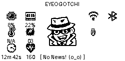

# Eyeogotchi

Eyeogotchi is a modular, extensible personal security tool for the Raspberry Pi Zero 2W that provides a unified platform for network awareness and defensive automation.

This project was inspired by the << Tamagotchi-like >> `Pwnagotchi` and `Bjorn: Cyber Viking` projects, with the intent of being used on the same hardware stack.



---
 
## 🚀 Installation

Clone the repo:

```
git clone https://github.com/z3r0-g/Eyeogotchi.git
cd Eyeogotchi
```

Run the installer:

```
scripts/install/install_eyeogotchi.sh
source ~/.bashrc
```

Start the service:

```
sudo systemctl start eyeogotchi
```

Open the Portal:

```
http://localhost
```

---

## 🧰 CLI

The CLI provides full control over configuration, extensions, logs, and runtime behavior.

```
eyeogotchi config
eyeogotchi extensions list
eyeogotchi extensions update
eyeogotchi extensions enable <name>
eyeogotchi extensions disable <name>
eyeogotchi restart
eyeogotchi logs
```

---

## (o_o) Priority‑Based Mood System
The real spirit of this project! The mascot reaction engine evaluates moods in strict priority order:

### 🔥 High‑Priority (always override)
- concerned — system errors
- sweating — temperature > 60°C
- stressed — CPU > 80%
- annoyed — WiFi disconnected
### ⚡ Event‑Driven (short‑lived)
- handshake → proud
- user_interaction → excited
- new_ap → curious

### 🕵️ Detective Mode
When bored too long:
- Enters detective mode for 600s
- Reads log lines
- Classifies them into moods
- Updates banners with noir narration
- Overrides ambient moods

### 🌙 Ambient States (fallback)
- bored — idle > 300s
- curious — extended boredom triggers detective mode
- happy — light CPU load
- sleeping — idle > 120s
- sleeping — default fallback

---
## 🧩 Extension Architecture

Eyeogotchi extensions live in:

```
extensions/<extension_name>/
```

Each extension includes:

- `extension.yaml` — metadata, config, entrypoint
- `service/main.py` — plugin implementation
- `api/routes.py` — optional API endpoints
- `renderer/` — optional UI components
- `assets/` — optional static files

Extensions are:

- Auto‑discovered  
- Auto‑loaded  
- Auto‑registered with the API  
- Configurable via `extensions.yaml`  
- Auto-Installable from Git via `extensions_sources`  

---

## 📦 Bundled Extensions
Eyogotchi was intended to be used as my own private security gateway for my laptop and/or local area network (depending on where it is plugged in). Beyond the platform, this includes extensions with the following functionality bundled:

- Gamified Display Renderer (for Waveshare 2.13 e‑ink)
- DNS Sinkhole (Safe Search, Ad Blocker, Secure Route)
- Network Endpoint Mapper (Know Thy Network Neighbors)
- Network Vulnerability Monitor (Know Thy Network Neighbors are Secure)

---

## 🧭 Repo Layout

```
core/       → shared infrastructure (config, logging, event bus, runtime)
extensions/    → individual functional extensions
scripts/    → install, update, maintenance helpers
systemd/    → service unit templates
tests/      → unit + integration tests
web/        → API + Portal UI
cli/        → Eyeogotchi CLI tool
```

---

## 🌱 Future / Community Modules

- Leightweight IPS (Local Area Network Sentry)
- LTE Monitor & Analytics (SIM7600G)
- Rayhunter Port/Integration for SIM7600G
- PiSugar UPS integration
- Bluetooth Tethering for UI/API Access
- AI‑driven Anomaly Detection (TinyLlama)
- Mesh Networking (include recognizing its pwnagotchi/bjorn cousins)

---

Eyeogotchi is designed to be **hackable**, **modular**, and **fun** — a personal security appliance you can extend, customize, and evolve.
